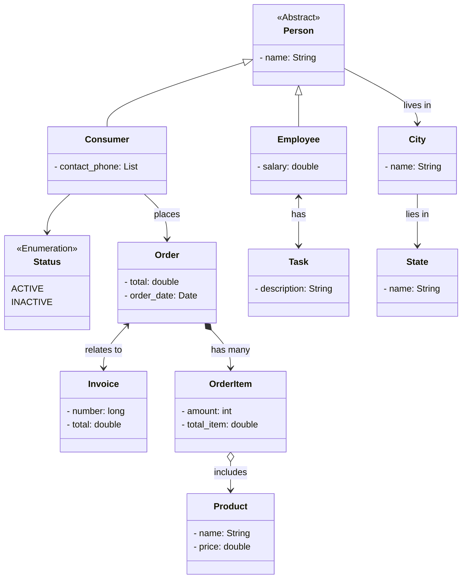

# rails-sales-project
My default project for testing new technologies. This time, with rails!

```mermaid
classDiagram
    Person <|-- Consumer
    Person <|-- Employee
    Consumer --> Status
    Person --> City :lives in
    City --> State :lies in
    Employee <--> Task :has
    Order <--> Invoice :relates to
    Order *--> OrderItem :has many
    OrderItem o--> Product :includes
    Consumer --> Order :places

    class Status {
        <<Enumeration>>
        ACTIVE
        INACTIVE
    }

    class Order {
        - total: double
        - order_date: Date
    }

    class Invoice {
        - number: long
        - total: double
    }

    class OrderItem {
        - amount: int
        - total_item: double
    }

    class Product {
        - name: String
        - price: double
    }

    class Person {
        <<Abstract>>
        - name: String
    }

    class Task {
        - description: String
    }

    class City {
        - name: String
    }

    class State {
        - name: String
    }

    class Consumer {
        - contact_phone: List<String>
    }

    class Employee {
        - salary: double
    }
```
